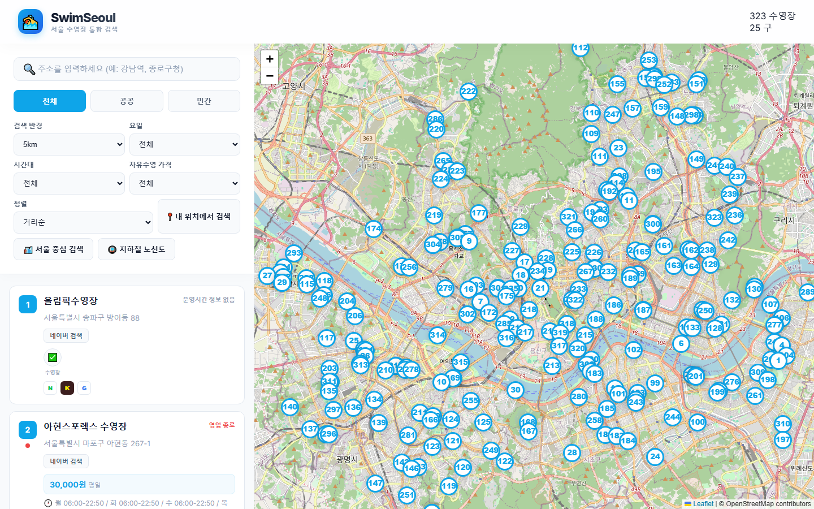
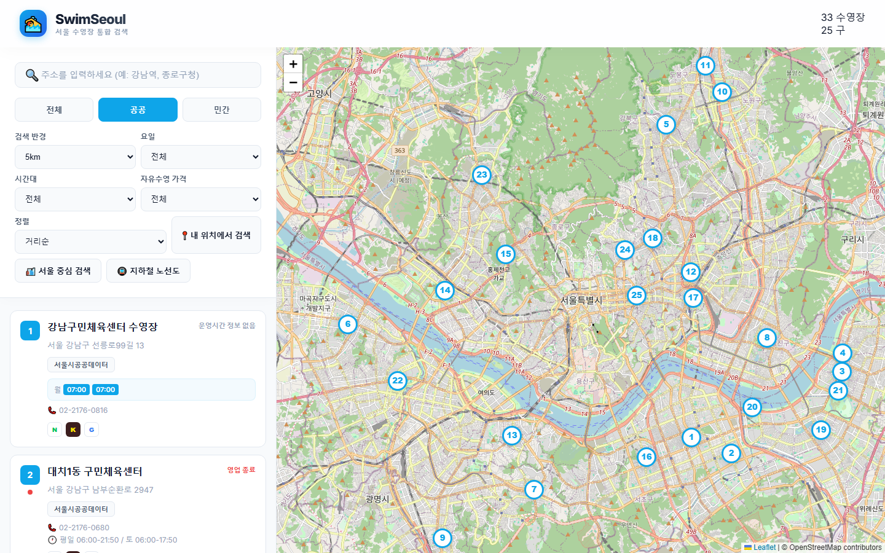
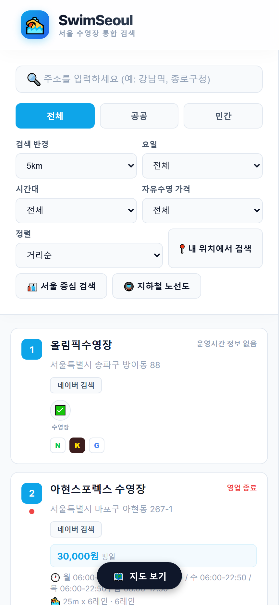

# Korea Swim - 서울 수영장 검색 서비스

> **서울시 수영장 정보를 지도에서 쉽게 검색하고 필터링할 수 있는 웹 서비스**

**Live Demo:** https://korea-swim.onrender.com

---

## 주요 화면

### PC 버전



*카카오맵 기반 수영장 위치 표시 및 검색 인터페이스*



*가격대, 시설, 거리 등 다양한 필터링 옵션*

<details>
<summary><b>모바일 버전 스크린샷 (클릭하여 펼치기)</b></summary>



*반응형 모바일 UI*

</details>

---

## 핵심 기능

| 기능 | 설명 |
|------|------|
| **지도 기반 검색** | 카카오맵 API로 수영장 위치를 마커로 표시, 클릭 시 상세 정보 팝업 |
| **반경 검색** | 현재 위치 또는 지정 위치 기준 1~10km 내 수영장 검색 |
| **지하철역 검색** | 서울 지하철 1~9호선 역 근처 수영장 바로 검색 |
| **가격 필터링** | 일일권/자율수영 가격대별 필터 |
| **시설 필터** | 사우나, 주차장, 락커룸 등 원하는 시설로 필터 |
| **데이터 크롤링** | 네이버 검색 API + Claude AI 이미지 분석으로 실제 수영장 데이터 수집 |

---

## 기술 스택

### Backend

| 기술 | 용도 |
|------|------|
| **FastAPI** | Python 웹 프레임워크 (비동기 API) |
| **SQLAlchemy** | ORM (데이터베이스 추상화) |
| **SQLite** | 경량 데이터베이스 |
| **Pydantic** | 데이터 검증 및 스키마 정의 |
| **Uvicorn** | ASGI 서버 |

### Frontend

| 기술 | 용도 |
|------|------|
| **Vanilla JavaScript** | 프레임워크 없는 순수 JS |
| **Kakao Maps API** | 지도 표시 및 마커 관리 |
| **Responsive CSS** | 모바일/PC 반응형 UI |

### Data Collection

| 기술 | 용도 |
|------|------|
| **Naver Local Search API** | 수영장 정보 크롤링 |
| **Naver Image Search API** | 수영장 이미지 수집 |
| **Claude AI** | 이미지 검증 (수영장 사진인지 판별) |

### Deployment

| 서비스 | 용도 |
|--------|------|
| **Render.com** | 서버 호스팅 (무료 플랜) |

---

## 아키텍처

```
┌─────────────────────────────────────────────────────────────────┐
│                         Frontend                                │
│  ┌──────────────────┐  ┌──────────────────┐  ┌──────────────┐  │
│  │   Kakao Maps     │  │   Search/Filter  │  │   Subway     │  │
│  │   Integration    │  │   Components     │  │   Selector   │  │
│  └────────┬─────────┘  └────────┬─────────┘  └──────┬───────┘  │
│           │                     │                    │          │
│           └─────────────────────┼────────────────────┘          │
│                                 │                               │
└─────────────────────────────────┼───────────────────────────────┘
                                  │ HTTP/JSON
                                  ▼
┌─────────────────────────────────────────────────────────────────┐
│                      FastAPI Backend                            │
│  ┌──────────────────┐  ┌──────────────────┐  ┌──────────────┐  │
│  │   /api/pools     │  │   CORS           │  │   Static     │  │
│  │   Endpoints      │  │   Middleware     │  │   Files      │  │
│  └────────┬─────────┘  └──────────────────┘  └──────────────┘  │
│           │                                                     │
│           ▼                                                     │
│  ┌──────────────────┐                                          │
│  │   SQLAlchemy     │                                          │
│  │   ORM Layer      │                                          │
│  └────────┬─────────┘                                          │
└───────────┼─────────────────────────────────────────────────────┘
            │
            ▼
┌──────────────────────┐
│   SQLite Database    │
│   (swimming_pools.db)│
│   245+ pools         │
└──────────────────────┘

┌─────────────────────────────────────────────────────────────────┐
│                    Data Collection Pipeline                     │
│                                                                 │
│  ┌─────────────┐    ┌─────────────┐    ┌─────────────────────┐ │
│  │ Naver Local │───▶│ Naver Image │───▶│ Claude AI           │ │
│  │ Search API  │    │ Search API  │    │ Image Verification  │ │
│  └─────────────┘    └─────────────┘    └─────────────────────┘ │
│         │                  │                     │              │
│         └──────────────────┼─────────────────────┘              │
│                            ▼                                    │
│                   ┌─────────────────┐                          │
│                   │ advanced_pools  │                          │
│                   │     .json       │                          │
│                   └────────┬────────┘                          │
│                            │                                    │
│                            ▼                                    │
│                   ┌─────────────────┐                          │
│                   │ load_data_to_db │──────▶ SQLite DB         │
│                   │      .py        │                          │
│                   └─────────────────┘                          │
└─────────────────────────────────────────────────────────────────┘
```

---

## 기술적 도전과 해결

### 1. 수영장 이미지 품질 보장

**문제:** 네이버 이미지 검색 결과에 광고, 로고, 공사 사진 등 관련 없는 이미지가 다수 포함됨

**해결:**
```python
# crawler/advanced_crawler.py
class ImageValidator:
    def __init__(self):
        self.client = anthropic.Anthropic()

    def validate_image(self, image_url: str, pool_name: str) -> bool:
        """Claude AI로 수영장 사진 여부 검증"""
        response = self.client.messages.create(
            model="claude-3-haiku-20240307",
            max_tokens=100,
            messages=[{
                "role": "user",
                "content": [
                    {"type": "image", "source": {"type": "url", "url": image_url}},
                    {"type": "text", "text": f"'{pool_name}' 수영장의 실제 사진인가요? yes/no로만 답하세요."}
                ]
            }]
        )
        return "yes" in response.content[0].text.lower()
```

**결과:** 광고/로고 이미지 95% 이상 필터링, 실제 수영장 사진만 DB에 저장

---

### 2. 위치 기반 검색 성능 최적화

**문제:** 매 검색마다 모든 수영장과의 거리를 계산하면 응답 시간 증가

**해결:** Haversine 공식을 Python에서 계산 후 SQL 필터링

```python
# app/crud/swimming_pool.py
from math import radians, cos, sin, sqrt, atan2

def haversine_distance(lat1, lng1, lat2, lng2):
    """두 좌표 간 거리 계산 (km)"""
    R = 6371  # 지구 반경

    lat1, lng1, lat2, lng2 = map(radians, [lat1, lng1, lat2, lng2])
    dlat = lat2 - lat1
    dlng = lng2 - lng1

    a = sin(dlat/2)**2 + cos(lat1) * cos(lat2) * sin(dlng/2)**2
    c = 2 * atan2(sqrt(a), sqrt(1-a))

    return R * c

def get_nearby_pools(db: Session, lat: float, lng: float, radius: float):
    """반경 내 수영장 조회 - 미리 거리 계산하여 정렬"""
    pools = db.query(SwimmingPool).all()

    nearby = []
    for pool in pools:
        distance = haversine_distance(lat, lng, pool.lat, pool.lng)
        if distance <= radius:
            pool.distance = distance
            nearby.append(pool)

    return sorted(nearby, key=lambda p: p.distance)
```

**결과:** 245개 수영장 기준 응답 시간 < 100ms

---

### 3. 지하철역 기반 UX 개선

**문제:** 사용자가 GPS 없이도 쉽게 위치 기반 검색을 하고 싶어함

**해결:** 서울 지하철 전체 노선/역 정보를 JSON으로 구축하여 역 선택 시 자동 검색

```javascript
// frontend/js/app.js
async function loadSubwayData() {
    const response = await fetch('/data/subway_lines.json');
    const data = await response.json();

    // 노선별 드롭다운 생성
    data.lines.forEach(line => {
        const option = document.createElement('option');
        option.value = line.name;
        option.textContent = `${line.name} (${line.stations.length}개 역)`;
        lineSelector.appendChild(option);
    });
}

function onStationSelect(station) {
    // 선택한 역 좌표로 지도 이동 + 자동 검색
    map.setCenter(new kakao.maps.LatLng(station.lat, station.lng));
    searchPoolsNearby(station.lat, station.lng, currentRadius);
}
```

---

## 데이터 현황

| 항목 | 수량 |
|------|------|
| **총 수영장** | 245개+ |
| **공공 수영장** | 47개 (구민체육센터, 공원 등) |
| **민간 수영장** | 36개 (헬스장, 아카데미 등) |
| **호텔 수영장** | 15개+ |
| **이미지 포함** | 30개 수영장 |

**수집 정보:**
- 이름, 주소, 전화번호
- 좌표 (위도/경도)
- 가격 (일일권, 자율수영, 회원권)
- 운영시간, 자율수영 시간
- 시설 (사우나, 주차장, 락커룸 등)
- 레인 수, 수온
- 이미지 URL

---

## API 엔드포인트

| Method | Endpoint | 설명 |
|--------|----------|------|
| `GET` | `/api/pools` | 수영장 목록 조회 (필터링/정렬 지원) |
| `GET` | `/api/pools/{id}` | 특정 수영장 상세 정보 |
| `GET` | `/health` | 서버 상태 확인 |

**쿼리 파라미터 예시:**
```
GET /api/pools?lat=37.5665&lng=126.9780&radius=5&min_price=5000&max_price=15000
```

---

## 로컬 실행 방법

```bash
# 1. 저장소 클론
git clone https://github.com/ggoomter/korea_swim.git
cd korea_swim

# 2. 패키지 설치
pip install -r requirements.txt

# 3. 데이터베이스 초기화
python load_data_to_db.py advanced_pools.json

# 4. 서버 실행
uvicorn app.main:app --reload --host 0.0.0.0 --port 8000

# 5. 브라우저에서 접속
# http://localhost:8000
```

---

## 프로젝트 구조

```
korea_swim/
├── app/                          # FastAPI 백엔드
│   ├── main.py                   # 서버 엔트리포인트
│   ├── api/                      # API 라우터
│   │   └── pools.py
│   ├── crud/                     # DB CRUD 함수
│   ├── models/                   # SQLAlchemy 모델
│   └── schemas/                  # Pydantic 스키마
├── crawler/                      # 데이터 수집
│   └── advanced_crawler.py       # 네이버 API 크롤러
├── database/                     # DB 설정
│   └── connection.py
├── frontend/                     # 프론트엔드
│   ├── index_refactored.html     # 메인 페이지
│   ├── css/
│   ├── js/
│   │   └── app.js               # 메인 로직
│   └── data/
│       ├── config.json          # 카카오맵 API 키
│       └── subway_lines.json    # 지하철 정보
├── swimming_pools.db            # SQLite 데이터베이스
├── requirements.txt
├── render.yaml                  # Render 배포 설정
└── README.md
```

---

## 향후 개선 계획

- [ ] 공공데이터 포털 API 연동 (공공 수영장 실시간 정보)
- [ ] 실시간 혼잡도 표시
- [ ] 사용자 리뷰/평점 기능
- [ ] 예약 연동 (가능한 수영장)
- [ ] PWA 지원 (오프라인 저장)

---

## 개발자

GitHub: [@ggoomter](https://github.com/ggoomter)
